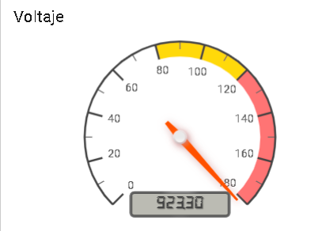
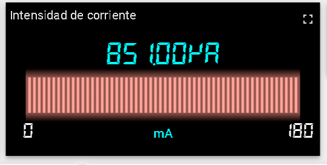
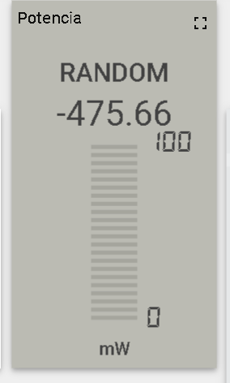
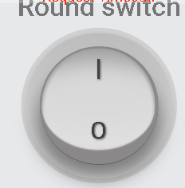
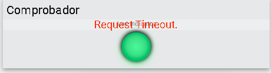
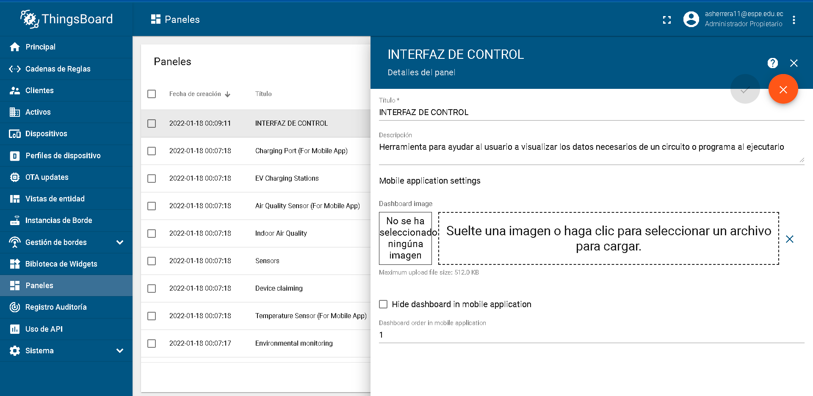
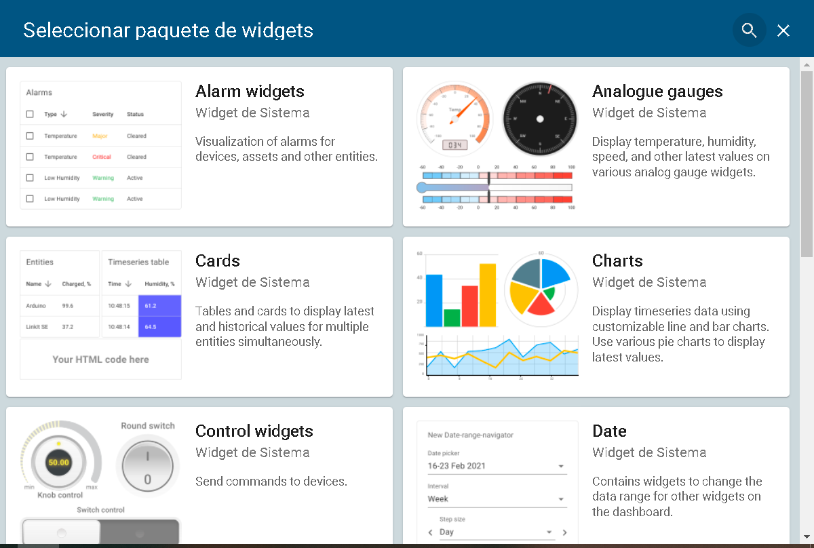
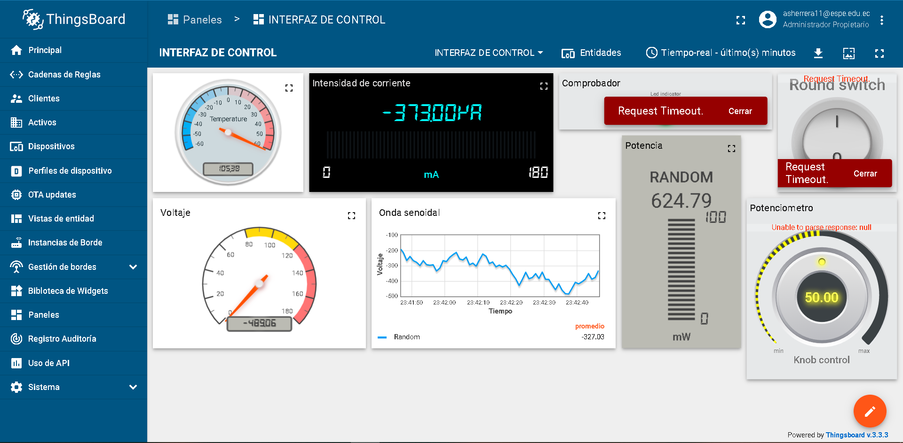

# INFORME-DE-TRABAJO-EXTRA

1.- OBJETIVOS

Objetivo General:

- Realizar una interfaz de control, mediante la herramienta de ThingsBoard para el control de los valores de un circuito identificando cada valor importante o relevante dentro de este, y asi obtener una interfaz que se pueda visualizar sus propiedades.

Objetivos especificos:

- Identificar las diversas herramientas que nos proporciona ThingsBoard para el control de sus  propiedades.

- Visualizar las caracteristicas principales en un panel para el correcto analisis del usuario.

- Utilizar las propiedades que se encuentran dentro del panel para poder realizar el analisis del circuito mas rapido.

2.- Marco Teorico:

ThingsBoard es una plataforma de código libre o abierto para almacenar, visualizar y analizar los datos de nuestros dispositivos o circuitos. Esta se centra en la gestión de lot, que significa internet de las cosas, porque tiene como objetivo conectar el máximo de objetos que nos rodean entre ellos.
Con esta plataforma tendremos acceso a una solución local o nube que estará lista para usar, que habilitará la estructura del servidor para aplicaciones que se utilicen. Es compatible con protocolos industriales como MQTT, CoAP y HTTP. Trata de combinar la toleración de fallos y bien rendimiento a la hora de capturar los datos del circuito para su análisis y control. Esto es posible mediante el servidor que se encarga de la comunicación con los dispositivos conectados a la red o en casos especiales con una placa de Arduino física la cual estará conectados directamente a la plataforma.

Sus características principales:

•	Seguridad: Soporte para aprovisionamiento y gestión de dispositivos a través de credenciales.

•	Amplia variedad de plugins: Personalización de cualquier aspecto.

•	Motor de reglas: Permite configurar las reglas para el estado de los dispositivos.

•	Gestión de loT de los datos:  Crea diferentes bases de datos para las entidades principales y los datos de telemetría.

ThingsBoard trabaja con lenguajes de programación tales como Python,Go, C/ C++ y otros idiomas, el objetivo  si no tenemos acceso a la app  de ThingsBoard en ejecución, se puede utilizar el live demo para que podamos utilizar la plataforma de manera online, en un apartado se puede utilizar emuladores de dispositivo ThingsBoard para simular dispositivos de la vida real y jugar con las API 

¿Qué es una interfaz de control?

La interfaz de control se refiere a un dispositivo de enlace entre un puerto de salida de un ordenador y los componentes eléctricos de un sistema, esta proporciona la potencia a los componentes eléctricos y actúa como memoria intermedia en la que se almacenan los caracteres, entre los componentes y el ordenador.

La interfaz de control, sirve como espacio de contenido de información del circuito o programa que estemos realizando y que este contara con las propiedades, que necesitamos para analizar el circuito, se el voltaje con un panel numérico que indique cuanta carga recibe y de igual manera potencia e intensidad.

Los widgets son las herramientas visuales que se utilizan dentro del panel las cuales son :

Manometros analogicos: Muestra los valores mediante un indicador con una aguja integrada, por lo que se utiliza tanto como valores de temperatura, humedad o velocidad, etc

Manometros digitales: Muestra los valores mediante un display digital que indica con luces la cantidad de valor que tenemos en esa magnitud, y de igual manera se utiliza para temperatura, humedad o velocidad,etc.

Widgets de control: Estos envian señales a los dispositivos tales como regular la resitencia con un potenciometro o el encendido o apagado de un circuito.

3.- Procedimiento

Primeramente crearemos una cuenta en la version demo en vivo dentro de la pagina de ThingsBoard por lo cual utilzaremos el apartado de github para registrarnos, la version demo cuenta con la simulacion casi completa de la version de escritorio por lo cual tiene ddescargado dentro del sistema o la pagina los diversons plugins mas importantes.

Entramos en la version demo de ThingsBoard, la cual entramos en el apartado de paneles para poder crear un nuevo panel de control, la cual simulara la interfaz de control, y agregamos los nuevos widgets, que son los controladores o indicadores que ayudan al usuario a visualizar el estado del circuito o programa.

Esta es el primer paso para la creacion de un panel o interfaz lo cual es entrar al apartado de paneles y crear un nuevo documento  para determianr el titulo de este.

Con los siguientes widgets se puede personalizar el panel ya que cuenta con controladores, graficas, mostradores y tablas de valores para el analisis de circuitos.

4.- Resultados

Lo personalizamos a nuestra manera para tener lo neceario dentro de la interfaz de control.

5.- Conclusiones

- La herramientas que se utilziazron son los widgets de thingsboard para la cual nos ayuda a ver graficas, valores y controladores de encedido y apagado.

- Los valores seran determinados en el editor de los widgets, tal que cambiemos la magnitud y los titulos de cada herramienta visual. 

- Modificamos los tamaños de los widgets, y establecemos los titulos de cada uno con sus respectivas funciones dentro de los widgets. 

6.- Bibliografia.

- Interfaces de sistemas de control de procesos, ERP, SAP, mantenimiento. (s. f.). Proleit. Recuperado 20 de enero de 2022, de https://www.proleit.es/plant-it/plant-it-connect/interfaces-de-comunicacion-parametrizables/

- La interfaz de control (FlowGo). (s. f.). Flowol 2. Recuperado 20 de enero de 2022, de http://platea.pntic.mec.es/vgonzale/cyr_0204/ctrl_rob/flowol/interfaz.htm#:%7E:text=Una%20interfaz%20de%20control%20es,los%20componentes%20y%20el%20ordenador.

- ¿Qué es una Interfaz de Usuario? - Ryte Wiki. (s. f.). Ryte Wiki. Recuperado 20 de enero de 2022, de https://es.ryte.com/wiki/Interfaz_de_Usuario

- Corrales, J. A. (2021, 12 febrero). Interfaz de usuario o UI: ¿qué es y cuáles son sus características? Rock Content - ES. Recuperado 20 de enero de 2022, de https://rockcontent.com/es/blog/interfaz-de-usuario/
   

